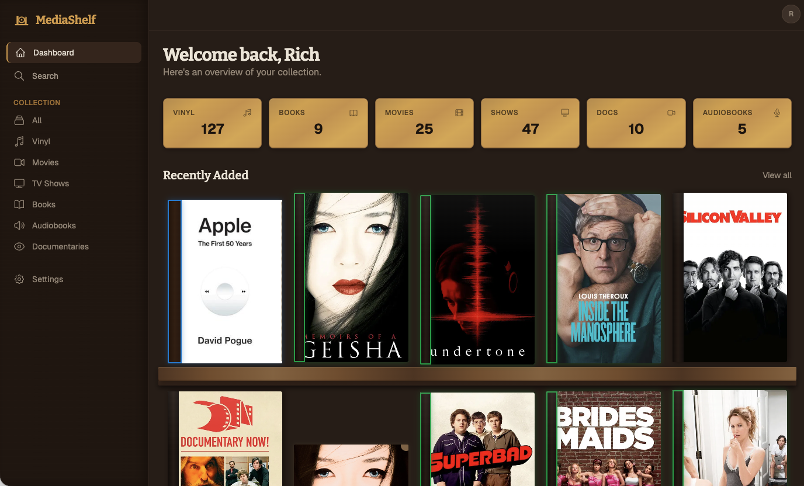
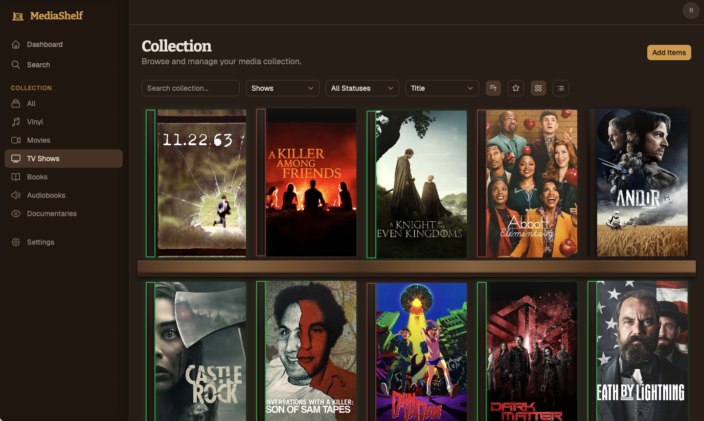
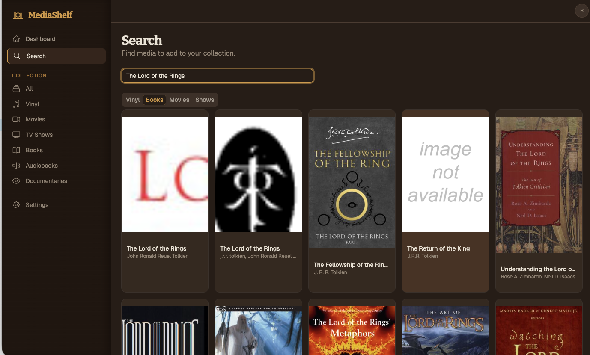
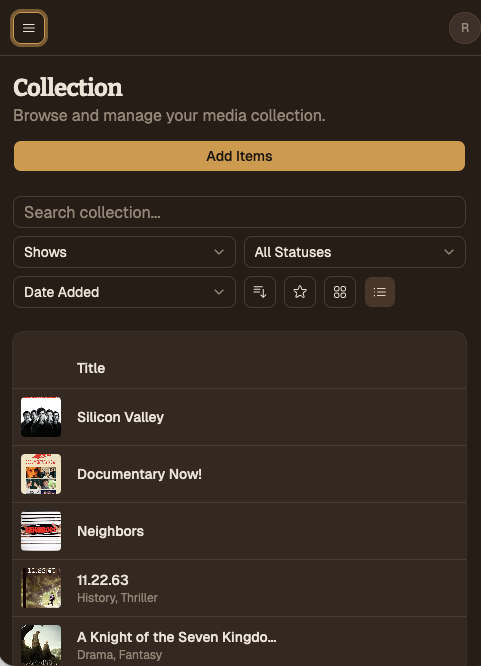

<p align="center">
  
</p>

<h1 align="center">MediaShelf</h1>

<p align="center">
  A self-hosted media cataloging app for tracking your vinyl records, books, movies, TV shows, audiobooks, and documentaries.
</p>

<p align="center">
  
  
  
  
  
</p>

---

## Screenshots

<p align="center">
  
</p>
<p align="center"><em>Dashboard with collection stats and recently added shelf</em></p>

<p align="center">
  
</p>
<p align="center"><em>Collection grid view with responsive shelf layout</em></p>

<p align="center">
  
</p>
<p align="center"><em>Search and add media from Discogs, TMDB, and Google Books</em></p>

<p align="center">
  
</p>
<p align="center"><em>Mobile-responsive layout</em></p>

---

## What is MediaShelf?

MediaShelf is a lightweight, Docker-based web app designed for small households (1–2 people) to catalog their personal media collections. Search for media using real external APIs, add items to your collection, rate them, tag them, and track what you own.

### Supported Media Types

- **Vinyl Records** — powered by Discogs
- **Books** — powered by Google Books
- **Movies & Documentaries** — powered by TMDB
- **TV Shows** — powered by TMDB
- **Audiobooks** — powered by Google Books

### Key Features

- **Search & Add** — Search external APIs and add items to your collection in one click
- **Collection Management** — Filter, sort, and browse by media type, status, rating, favorites, and tags
- **Status Tracking** — Color-coded glow borders indicate item status at a glance (completed, in progress, wishlist, owned, dropped)
- **Responsive Shelf Layout** — Items fill the shelf width naturally, scaling from 2 columns on mobile to 6 on large monitors
- **Household Support** — Multiple user accounts with admin/member roles; view each other's collections
- **Dark Mode First** — Clean dark UI with light mode and system theme options
- **Fully Self-Hosted** — Runs entirely on your own hardware via Docker Compose
- **Mobile Friendly** — Responsive design that works on phones, tablets, and desktops

---

## Quick Start

### Prerequisites

- [Docker](https://docs.docker.com/get-docker/) and [Docker Compose](https://docs.docker.com/compose/install/)
- (Optional) API keys for [Discogs](https://www.discogs.com/settings/developers) and [TMDB](https://www.themoviedb.org/settings/api) — the app works without them, but search won't return results for those sources

### 1. Clone the repo

```bash
git clone https://github.com/rcmarchetti3/media-shelf.git
cd media-shelf
```

### 2. Create your `.env` file

```bash
cp .env.example .env
```

Edit `.env` and set:

| Variable | Required | Description |
|----------|----------|-------------|
| `POSTGRES_PASSWORD` | Yes | Database password (change from default) |
| `SECRET_KEY` | Yes | Random string for JWT signing — generate with `openssl rand -hex 32` |
| `DISCOGS_TOKEN` | No | Discogs personal access token for vinyl search |
| `TMDB_API_KEY` | No | TMDB API key for movie/show/documentary search |
| `CORS_ORIGINS` | For remote access | Comma-separated allowed origins (e.g. `https://shelf.yourdomain.com`) |
| `WEB_PORT` | No | Port to expose the web UI (default: `8080`) |

### 3. Start the stack

```bash
docker compose up -d --build
```

### 4. Open the app

Navigate to `http://localhost:8080` (or whatever port you set).

The first user to register automatically becomes the **admin**.

---

## Architecture

```
┌─────────────┐     ┌─────────────┐     ┌─────────────┐
│   Frontend   │────▶│   Backend   │────▶│  PostgreSQL  │
│  React/Nginx │     │   FastAPI   │     │     16       │
│   port 80    │     │  port 8000  │     │  port 5432   │
└─────────────┘     └─────────────┘     └─────────────┘
                           │
                    ┌──────┴──────┐
                    │ External APIs│
                    │ Discogs     │
                    │ Google Books│
                    │ TMDB        │
                    └─────────────┘
```

| Layer | Tech |
|-------|------|
| Database | PostgreSQL 16 (Alpine) |
| Backend | Python 3.12, FastAPI, SQLAlchemy 2.0 (async), Alembic |
| Frontend | React 18, TypeScript, Vite, Tailwind CSS v4, Base UI |
| Auth | JWT (access + refresh tokens), bcrypt password hashing |
| Containers | Docker Compose — 3 services (db, api, web) |

---

## Local Development

The `docker-compose.override.yml` provides hot-reload for development:

```bash
# Start with hot-reload (auto-applied)
docker compose up -d --build

# Frontend: Vite dev server on http://localhost:5173
# Backend: Uvicorn with --reload on http://localhost:8000
# API docs: http://localhost:8000/docs
```

Changes to frontend and backend code are reflected immediately without rebuilding.

### Running TypeScript checks

```bash
# Inside the web container
docker exec -it media-shelf-web-1 npx tsc -b --noEmit
```

### Database migrations

```bash
# Create a new migration
docker exec -it media-shelf-api-1 python -m alembic revision --autogenerate -m "description"

# Apply migrations
docker exec -it media-shelf-api-1 python -m alembic upgrade head
```

---

## Production Deployment

### With a reverse proxy (Cloudflare Tunnel, Nginx, Traefik, etc.)

1. Clone the repo on your server
2. Create `.env` with production values (strong passwords, real API keys, CORS origins)
3. Set `WEB_PORT` to an available port
4. Run `docker compose up -d --build`
5. Point your reverse proxy at `http://localhost:<WEB_PORT>`

The production build uses multi-stage Docker images — the frontend compiles to static files served by nginx, and the backend runs Alembic migrations automatically on startup.

### Deploy script

If you develop locally and deploy to a server on your LAN, the included `deploy.sh` script handles everything:

```bash
./deploy.sh
```

This pushes to GitHub, rsyncs files to your server, and rebuilds containers. Edit the `SERVER` and `REMOTE_DIR` variables at the top of the script to match your setup.

---

## API Documentation

When running locally, interactive API docs are available at:

- **Swagger UI**: [http://localhost:8000/docs](http://localhost:8000/docs)
- **ReDoc**: [http://localhost:8000/redoc](http://localhost:8000/redoc)

### Key endpoints

| Method | Endpoint | Description |
|--------|----------|-------------|
| `POST` | `/api/v1/auth/register` | Register a new user |
| `POST` | `/api/v1/auth/login` | Log in and get tokens |
| `GET` | `/api/v1/collection/` | List collection items (with filters) |
| `POST` | `/api/v1/collection/` | Add item to collection |
| `PATCH` | `/api/v1/collection/{id}` | Update item (rating, status, tags, etc.) |
| `GET` | `/api/v1/search/{type}?q=` | Search external APIs |
| `GET` | `/api/v1/collection/stats` | Collection stats by media type |

---

## Project Structure

```
media-shelf/
├── backend/
│   ├── app/
│   │   ├── api/v1/          # Route handlers (auth, collection, search, users)
│   │   ├── models/          # SQLAlchemy models
│   │   ├── schemas/         # Pydantic request/response schemas
│   │   ├── services/        # External API clients (Discogs, TMDB, Google Books)
│   │   ├── config.py        # Environment config
│   │   ├── database.py      # Async DB engine & session
│   │   ├── dependencies.py  # Auth dependencies
│   │   └── main.py          # FastAPI app entry point
│   ├── alembic/             # Database migrations
│   ├── Dockerfile           # Multi-stage (dev + production)
│   └── requirements.txt
├── frontend/
│   ├── src/
│   │   ├── components/      # UI components (layout, shared)
│   │   ├── pages/           # Route pages
│   │   ├── lib/             # API client, auth context, types
│   │   └── hooks/           # Custom React hooks
│   ├── Dockerfile           # Multi-stage (dev + nginx production)
│   └── nginx.conf           # Production reverse proxy config
├── docker-compose.yml           # Production stack
├── docker-compose.override.yml  # Dev hot-reload overrides
├── deploy.sh                    # One-command deploy script
└── .env.example                 # Environment template
```

---

## Getting API Keys

### Discogs (Vinyl Records)

1. Go to [Discogs Developer Settings](https://www.discogs.com/settings/developers)
2. Click **Generate new token**
3. Copy the token to `DISCOGS_TOKEN` in your `.env`

### TMDB (Movies, TV Shows, Documentaries)

1. Create an account at [TMDB](https://www.themoviedb.org/)
2. Go to [API Settings](https://www.themoviedb.org/settings/api)
3. Request an API key (choose "Developer" for personal use)
4. Copy the API key (v3 auth) to `TMDB_API_KEY` in your `.env`

### Google Books (Books, Audiobooks)

No API key needed — the Google Books API is free for basic usage.

---

## License

MIT
